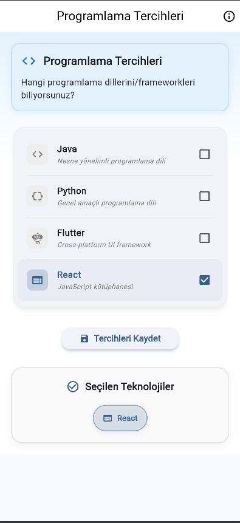

# 📱 Checkbox Form Uygulaması

> **Erciyes Üniversitesi Bilgisayar Mühendisliği**  
> **Mobile Application Development**  
> **Dersin Öğretim Üyesi: Fehim Köylü**

Bu proje, Flutter kullanılarak geliştirilmiş bir mobil uygulamadır.  
Kullanıcıların programlama dilleri ve framework'ler hakkındaki tercihlerinin checkbox'lar ile seçilmesini, bu tercihlerin cihazda saklanarak tekrar görüntülenmesini sağlar.

---

## 🛠️ Kullanılan Teknolojiler

- **Flutter:** Cross-platform mobil uygulama geliştirme framework'ü
- **Dart:** Uygulama geliştirme dili
- **Material Design:** Modern ve kullanıcı dostu arayüz tasarım dili
- **SharedPreferences:** Kullanıcı tercihlerini cihaz üzerinde kalıcı olarak saklamak için yerel depolama API'si

---

## 🚀 Uygulama Özellikleri

### ✅ Kullanıcı Tercihleri

- Java, Python, Flutter ve React için checkbox seçenekleri
- Seçilen teknolojilerin anlık olarak görsel gösterimi

### 💾 Veri Saklama

- SharedPreferences kullanılarak kullanıcı tercihleri kalıcı olarak cihazda saklanır
- Uygulama kapansa bile tercihler korunur
- Uygulama yeniden açıldığında tercihler otomatik olarak yüklenir

### 🎨 Modern UI

- Material Design bileşenleri (Card, Container, Chip) kullanımı
- Gölgeler, köşe yuvarlatmaları ve renk geçişleri ile zenginleştirilmiş arayüz
- Responsive (farklı ekran boyutlarına uyumlu) tasarım

---

## 🏩 Uygulama Mimarisi

- **main.dart:** Ana uygulama girişi ve tema ayarlarını içerir
- **screens/checkbox_form_page.dart:** Checkbox form ekranı ve veri saklama işlemleri burada yönetilir

🔹 Her UI bileşeni ayrı metotlar içinde tanımlanarak kod okunabilirliği ve bakım kolaylığı sağlanmıştır.

---

## 📂 Veri Saklama Mekanizması

- SharedPreferences ile anahtar-değer çifti yapısında veri saklanır
- Desteklenen veri tipleri: `boolean`, `string`, `integer`
- Veri saklama ve yükleme işlemleri asenkron (async) metodlarla gerçekleştirilir

---

## 🔥 Nasıl Çalışır?

1. Uygulama açıldığında, daha önce kaydedilmiş tercihler (varsa) otomatik olarak yüklenir
2. Kullanıcı, istedigi teknolojileri checkbox'lardan seçer
3. "Tercihleri Kaydet" butonuna basıldığında seçimler kaydedilir
4. Seçilen teknolojiler ekranın alt kısmında Chip bileşenleri şeklinde gösterilir
5. Uygulama tekrar başlatılsa bile kayıtlı tercihler otomatik olarak yüklenir

---

## 📸 Ekran Görüntüsü

> _assets/screenshot.png_ dosyasından alınmıştır.

---

## 🎥 Ekran Videosu

[Video Demo](assets/ekran_kayıt.mp4)
<video src="assets/ekran_kayıt.mp4" controls width="600"></video>

> _assets/ekran_kayıt.mp4_ dosyasından alınmıştır.

---

## 👨‍💻 Geliştirici

**Ahmet Talha Biçer**  
Erciyes Üniversitesi - Bilgisayar Mühendisliği
